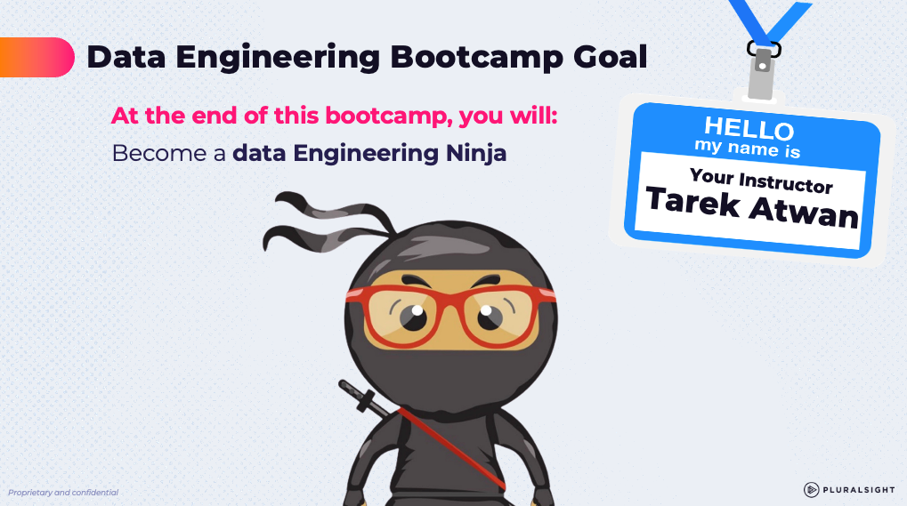

# TechCatalyst DE 2026: Proposed Curriculum

This is an 8-week Data Engineering Bootcamp curriculum for **TechCatalyst DE 2026**.

This hands-on program is designed for fresh graduates and junior data engineers (1–2 years of experience). The core objective is to prepare students for production-grade roles by modeling a single, continuous, real-world industry project—the **Large-Scale Data Ingestion & Analytics Pipeline**—thoughtfully mapped across the entire course. 

The 2026 curriculum shifts primary cloud focus to **Google Cloud Platform (GCP)** (with AWS as a secondary conceptual overlay), introduces modern data stack standards with **Snowflake** and **dbt**, integrates **AI-native features** (Cortex AI, Gemini API, and Vertex AI), incorporates **Big Data processing with PySpark & Databricks**, and establishes a strict, scaffolded developer progression to teach solid coding practices before introducing AI coding assistants like **GitHub Copilot**.

---

## Strategic Pedagogy: The Coding & AI Progression

To address the modern challenge where new engineers struggle to code due to over-reliance on autocomplete engines, this curriculum enforces a strict **"AI-Free Zone"** for the first four weeks:

1. **Weeks 1–4 (Foundations By Hand):** Students write Python, SQL, dbt, and Git commands from scratch. No GitHub Copilot or LLM-generated code is permitted. This builds syntax familiarity, debugging resilience, and a solid understanding of execution errors.
2. **Week 5 (Big Data & PySpark):** Students scale their coding skills using PySpark and Databricks as a learning environment, before transitioning to deploying production jobs on managed cloud clusters (GCP Dataproc and AWS EMR).
3. **Week 6 (AI Integration & Copilot):** **GitHub Copilot** is formally introduced. The focus is not just on code generation, but on **Prompt/Context Engineering** and **Rigorous Code Review/Validation workflows**. Students are trained to act as "code editors" who must verify correctness rather than blindly accepting AI suggestions.

---

## Longitudinal Project Thread: Large-Scale Ingestion & Analytics (e.g., NYC Taxi Data)

Instead of disjointed daily exercises, students work on a single continuous pipeline that processes a high-volume public dataset (such as the **NYC City Taxi Parquet dataset**, containing millions of rows, or a comparable client-specific dataset):
* **Week 1:** Design the conceptual lakehouse/warehouse pipeline architecture.
* **Week 2:** Pull and clean raw metadata records from a REST API and land them in GCS using Python.
* **Week 3:** Ingest event streaming and batch data via Pub/Sub and Dataflow, loading them into BigQuery tables, and apply PII masking.
* **Week 4:** Move data to Snowflake, run analytical SQL queries, write dbt models, write assertions to test quality, and set up a GitHub Actions CI/CD workflow to validate the code.
* **Week 5:** Scale processing using PySpark to transform large Parquet files, starting in Databricks and then executing batch jobs on GCP Dataproc and AWS EMR.
* **Week 6:** Call Vertex AI and the Gemini API to auto-classify and tag unstructured feedback or comments.
* **Week 7:** Connect interactive data applications (Streamlit) and enterprise BI dashboards (client's choice) to the cleaned data.
* **Week 8:** The Capstone. Teams integrate and deploy this end-to-end pipeline in a production-ready state.

---

## Platform Verification Notes (validated June 2026)

These platform facts were verified in June 2026 and supersede any earlier naming. See `Curriculum_Mapping_2026.md` for the day-by-day mapping.

* Instructor Note: for any changes, conflicts, I will keep this table updated.

| Platform | What changed / what to teach |
| :--- | :--- |
| **GCP DE** | Dataplex renamed **Knowledge Catalog** (Apr 2026). BigQuery began restricting Legacy SQL availability after June 1, 2026 — teach **GoogleSQL only**. **BigQuery Data Engineering Agent** now GA (natural-language pipeline building). Dataflow lineage in Knowledge Catalog is GA. |
| **GCP AI** | **Vertex AI** rebranded **Gemini Enterprise Agent Platform**; unified **google-genai SDK** replaces the deprecated `google-generativeai` package. Current models: Gemini 2.5 family (stable) and 3.x. Gemini callable from BigQuery SQL (`ML.GENERATE_TEXT` / AI functions) — DE-native GenAI pattern. |
| **AWS DE** | Focus on **SageMaker Lakehouse + S3 Tables (managed Iceberg) + Glue**. EMR still valid for the Spark deployment day; **S3 Tables** for Apache Iceberg. |
| **Snowflake** | **dbt Projects on Snowflake** runs dbt natively (incl. Fusion engine) . **Openflow** (managed NiFi) = ingestion. Cortex: **AISQL functions** (COMPLETE, CLASSIFY, SUMMARIZE…). Use current naming in slides. |
| **dbt** | **Fusion engine** (Rust, 30× faster parse) + official **VS Code extension** (requires Fusion, free). Will cover dbt with Fusion + VS Code; concepts identical to Core. |
| **Databricks** | Community Edition is retired → **Free Edition** (serverless which is what we will use in this class). Delta Lake, notebooks, SQL, basic Unity Catalog all work. Jobs/pipelines now branded **Lakeflow**. Certifications are out of scope for this cohort. |

---

## Week-by-Week Curriculum Breakdown

---

### Week 1 — Data & Cloud Foundations *(June 22–26)*

**Theme:** Set the stage — what is data engineering, why does cloud matter, and how do we set up — ending with each team's pipeline architecture for the 8-week NYC Taxi project thread.

| Day | Topic | Details / Labs |
| :--- | :--- | :--- |
| **Day 1** | Data Primer & DE Roles | Types of data (structured, semi-structured, unstructured), batch vs. streaming concepts, the Modern Data Stack, and roles in DE. |
| **Day 2** | Cloud Fundamentals | Core concepts: IaaS vs. PaaS vs. SaaS. Conceptual comparison of GCP vs. AWS services. IAM basics and billing management. Guided BigQuery Sandbox preview using Citi Bike public data and the bytes-processed cost model. |
| **Day 3** | Developer Foundations | VS Code & GitHub Codespaces (with free-tier budget discipline). Python environments: `venv`/`pip` baseline plus `conda` and `uv` awareness. Hands-on **Git/GitHub deep dive** — the solo cycle (init, status, add, commit, diff, log) through the remote (push, pull, clone, fetch). Two labs. |
| **Day 4** | Data at Rest | Object-storage architectures (lake/lakehouse/warehouse/mart), storage–compute separation, file formats & physical layout, lifecycle & protection controls. **Labs:** secure GCS landing zone (console + CLI), query-in-place with a BigQuery external table, and a team NYC-Taxi storage-convention design. S3/Azure mappings throughout. |
| **Day 5** | Data Architectures & Pipeline Thread | Think like an architect: translate business needs into system requirements and a data spec. Pipeline vocabulary, ETL/ELT/Reverse ETL, orchestration, data quality, and data contracts. Core patterns: batch/streaming, Lambda, Kappa, and Medallion (Bronze/Silver/Gold). Architecture diagramming grammar (Draw.io). **Pipeline kickoff:** NYC Taxi dataset introduction. Labs: read a reference architecture, then teams design and defend their end-to-end conceptual pipeline — the living document they revise in Weeks 3, 5, and 7. |

**Weekly Deliverable:** Team pipeline architecture diagram (Draw.io) + design narrative for the NYC Taxi pipeline.

---

### Week 2 — Developer Foundations *(June 29–July 2 · 4 days)*

> [!IMPORTANT]
> **Holiday:** July 4, 2026 falls on a Saturday → observed **Friday, July 3**. Week 2 runs Monday–Thursday only (4 days). The AI-Free Zone (no Copilot/LLM-generated code) applies to all of **Weeks 1–4**, not just this week.

**Theme:** Developer foundations — how data engineers write, version, and execute code by hand.

| Day | Topic | Details / Labs |
| :--- | :--- | :--- |
| **Day 1** | Linux CLI & Git Collaboration | Shell basics: filesystem commands, pipes (`\|`), searching (`grep`), cron. Git command line: `git init/clone/commit/push`, branching, PRs, and resolving conflicts. |
| **Day 2** | Python Foundations for DE | Core Python coding: variables, standard data types, collections (lists, dicts, tuples, sets), control flow (loops, conditionals), and custom functions. |
| **Day 3** | Intermediate Python & File I/O | Object-Oriented Programming (OOP) basics (classes/methods for data models), error handling, reading/writing CSV/JSON files, and making API requests using the `requests` library. |
| **Day 4** | Pandas & Polars for DE | Intro to pandas DataFrames (reading files, cleaning, filtering, joins, aggregations). Lab: Pull API data, clean with pandas, and land in GCS. 30-min comparison of pandas vs. Polars (syntax and speed). |
| **Day 5** | *July 3 — Holiday (observed July 4)* | *No class.* |

**Weekly Deliverable:** A hand-written Python script that pulls mock metadata from a public API, performs basic cleaning in pandas, and uploads it to a GCP GCS bucket.

---

### Week 3 — Modern Data Warehousing & SQL (GCP-First) *(July 6–10)*

**Theme:** Storage and querying with GCP as the primary workhorse.

| Day | Topic | Details / Labs |
| :--- | :--- | :--- |
| **Day 1** | Modern Data Warehousing | ETL vs. ELT, data lakes vs. data warehouses vs. lakehouses. Schema design: star schemas, snowflake schemas, and columnar storage. |
| **Day 2** | GCP BigQuery Foundations | BQ Architecture: storage vs. compute decoupling. Managing datasets and tables (internal vs. external), partitioning, clustering, and console query execution. |
| **Day 3** | SQL Primer (BigQuery) | Writing queries *by hand* in **GoogleSQL only** (Legacy SQL availability is restricted for many projects after June 1, 2026): SELECT, WHERE, JOINs, GROUP BY, aggregations, and HAVING. Querying the high-volume data loaded into BigQuery. |
| **Day 4** | Ingestion & Batch Pipelines | Event streaming vs. batch ingestion. Lab: Spin up GCP Pub/Sub topics. Introduction to Apache Beam concepts and running a GCP Dataflow batch pipeline (loading GCS files into BigQuery). |
| **Day 5** | Orchestration & GCP Governance | Core orchestration concepts. Lab: Introduction to Cloud Composer (Airflow) DAGs. **GCP Security & Governance:** IAM roles, **Knowledge Catalog** (formerly Dataplex) data cataloging, and PII/PHI column-level masking in BigQuery. |

**Weekly Deliverable:** An end-to-end mini-pipeline: Pub/Sub → Dataflow (scaffolded) → BigQuery, with SQL queries summarizing the loaded dataset, and security policies applied.

---

### Week 4 — Snowflake, dbt & Advanced SQL *(July 13–17)*

**Theme:** The analytical warehouse layer — transformations, advanced SQL, and data modeling.

| Day | Topic | Details / Labs |
| :--- | :--- | :--- |
| **Day 1** | Snowflake Architecture | Introduction to Snowflake: decoupled storage and compute, virtual warehouses, databases, schemas, and RBAC roles. **Cost Optimization:** Warehouse sizing, auto-suspend, and table types (permanent, transient, temporary). |
| **Day 2** | Advanced SQL & Performance | Analytical SQL: window functions (`ROW_NUMBER`, `LEAD`/`LAG`, running totals), CTEs, and query performance tuning (pruning, clustering, and monitoring query profile costs) in BigQuery & Snowflake. |
| **Day 3** | dbt (Fusion) & Integration | Introduction to dbt (Data Build Tool) using the **Fusion engine + official VS Code extension**. Lab: Set up a dbt project, define sources and models, write transformations on Snowflake data, and configure basic tests (unique, not_null, accepted_values). Demo **dbt Projects on Snowflake** (native dbt) after the local project. |
| **Day 4** | Advanced dbt & CI/CD | Advanced dbt modeling: incremental models, custom macros, seeds, and snapshots. Lab: Build a **GitHub Actions CI/CD workflow** that automatically runs and tests dbt models on pull requests. |
| **Day 5** | Snowflake GenAI & Governance | Cortex **AISQL functions** (COMPLETE, CLASSIFY, SUMMARIZE…) and Document AI. Lab: Build an LLM-powered data enrichment pipeline to summarize text columns. **Snowflake Governance:** column-level masking policies, tagging sensitive data. |

**Weekly Deliverable:** A dbt project on Snowflake with comprehensive data tests, a GitHub Actions CI/CD validation workflow, and a Cortex LLM-enriched model.

---

### Week 5 — Big Data & PySpark ETL (Databricks) *(July 20–24)*

**Theme:** Distributed data processing, lakehouse formats, and deploying production Spark jobs.

> [!NOTE]
> **Pedagogical Strategy:** **Databricks Free Edition** (serverless) is the platform for all hands-on work this week — learning, development, and production job deployment. **GCP Dataproc** and **AWS EMR** are covered conceptually as important industry patterns: students study and annotate the equivalent submission commands to understand portability, but no live clusters are created on those platforms. The core lesson is that the same PySpark script runs on Databricks, Dataproc, and EMR without code changes.

| Day | Topic | Details / Labs |
| :--- | :--- | :--- |
| **Day 1** | Big Data & Spark Foundations | Distributed computing concepts, Spark cluster architecture (Driver vs. Executor), Spark Session, RDDs, and Spark DataFrames. |
| **Day 2** | Databricks & PySpark Essentials | **Databricks Free Edition** (serverless) setup, notebooks, and writing basic PySpark DataFrame transformations (select, filter, basic functions). |
| **Day 3** | PySpark & Lakehouse Formats | Complex transformations (joins, aggregations, window functions). Introduction to modern lakehouse formats: Delta Lake and Apache Iceberg (ACID transactions, time travel, schema evolution); mention **AWS S3 Tables** (managed Iceberg) when teaching Iceberg. |
| **Day 4** | Production Spark on Databricks | Packaging PySpark notebooks into standalone scripts (argparse, logging, `if __name__ == "__main__"`). Deploy as a **Databricks Job (Lakeflow)**. Conceptual walkthrough of equivalent Dataproc and EMR submission — same script, different wrapper. |
| **Day 5** | Choosing Your Engine | Portability proof: same `etl_trips.py` runs on Databricks, Dataproc, and EMR without code changes. Serverless Spark overview. Engine decision map. Week 5 deliverable shipped. |

**Weekly Deliverable:** A PySpark ETL script developed and deployed as a Databricks Job, with a portability analysis showing how the same script maps to Dataproc and EMR, and a Delta Lake lab demonstrating ACID transactions and time travel.

---

### Week 6 — NLP, LLMs, GenAI & GitHub Copilot *(July 27–31)*

**Theme:** AI engineering and introducing AI coding assistants to accelerate development.

| Day | Topic | Details / Labs |
| :--- | :--- | :--- |
| **Day 1** | GenAI Foundations | Landscape: Generative AI ecosystem, Foundation Models, LLM architectures, tokenization, embeddings, and basic prompt engineering. |
| **Day 2** | Python API Integration | Programmatic AI: accessing LLMs via REST APIs, **google-genai SDK** (unified; the deprecated `google-generativeai` package is not used), and LangChain high-level concepts. |
| **Day 3** | Vertex AI / Gemini Enterprise Agent Platform (MLOps) | Platform overview (Vertex AI is now branded **Gemini Enterprise Agent Platform**). Tie to pipeline: DE's role in ML (feeding clean datasets to models, deploying AutoML models, and consuming predictive outputs, e.g., taxi demand forecasting). |
| **Day 4** | Applied NLP on GCP | Gemini API for text generation, classification, and embeddings. Lab: Classify comments or notes and extract metadata using the Gemini API — and call Gemini from **BigQuery SQL (`ML.GENERATE_TEXT` / AI functions)** for the DE-native pattern. |
| **Day 5** | GitHub Copilot for DE | **Introducing Copilot:** Setup, inline suggestions, Copilot Chat, and Agent Mode. Best practices: **Prompt/Context Engineering for DE** and **Rigorous Code Review/Validation workflows** (avoiding AI dependency bugs). Demo the **BigQuery Data Engineering Agent** (natural-language pipeline building, now GA). |

**Weekly Deliverable:** An LLM-powered pipeline component (built using Copilot assistance but reviewed/debugged by hand) that auto-tags records based on Gemini classification.

---

### Week 7 — BI, Visualization & Python Data Apps *(August 3–7)*

**Theme:** From data to decisions — business intelligence dashboards and programmatic data apps.

> [!NOTE]
> **Confirmed BI Tool Selection (Hartford):**
> - **Day 2 — Tableau** (primary tool, industry standard, Hartford-deployed)
> - **Day 3 — ThoughtSpot** (AI-powered search analytics)
> - **Day 4 — Looker** (optional, time-permitting; free tier available via Google account)

| Day | Topic | Details / Labs |
| :--- | :--- | :--- |
| **Day 1** | Storytelling & Streamlit Data Apps | Principles of data storytelling and dashboard layout. **Python Data Viz:** Introduction to **Streamlit** (widgets, state management, caching). Lab: Connect Streamlit to BigQuery/Snowflake and build an interactive data app with filters and plots. |
| **Day 2** | Tableau | Tableau Desktop/Online connected to BigQuery or Snowflake. Calculated fields, LOD expressions, filters, parameters, and dashboard layout. Lab: Build an executive-facing NYC Taxi dashboard. |
| **Day 3** | ThoughtSpot | ThoughtSpot AI search analytics. SpotIQ auto-insights, Liveboards, embedding basics. Lab: Natural-language queries on the NYC Taxi dataset; compare AI-generated insights to the Tableau dashboard. |
| **Day 4** | Comparative BI Architecture + Looker (optional) | Architectural review: self-service reporting models, semantic layers, data caching/scheduling, and enterprise access controls. **If time permits:** Looker intro via Google account (LookML explore, a single dashboard). |
| **Day 5** | Capstone Preparation | **Capstone Kickoff:** Dataset reveal (NYC Taxi or client-specific data), project brief, team formation, and initial exploratory analysis. |

**Weekly Deliverable:** An interactive Python data app (Streamlit) + a Tableau dashboard connected to BigQuery or Snowflake, with a ThoughtSpot Liveboard as a comparison artifact.

---

### Week 8 — Capstone *(August 10–14)*

**Theme:** 100% project week — no new instruction. Teams build, integrate, and present their end-to-end pipeline using everything learned in Weeks 1–7.

> [!NOTE]
> Week 8 is a pure capstone sprint. The instructor's role shifts to coach/reviewer. No new concepts are introduced. Each day has a loose milestone to keep teams on track, but there are no scheduled lectures.

* **Day 1 — Architecture & Kickoff:** Teams finalize architecture diagrams and divide responsibilities. Daily stand-ups begin (15 min). Instructor reviews designs and flags risks.
* **Day 2 — Ingestion Sprint:** GCS → Dataflow/PySpark ETL → BigQuery or Snowflake. Teams use their own Week 3–5 code as the starting point; a pre-built template is available if needed.
* **Day 3 — Transformation & Governance Sprint:** Snowflake/dbt modeling, `dbt test`, PII masking, **Knowledge Catalog** lineage tagging.
* **Day 4 — AI Enrichment + BI/App Integration:** Cortex AI or Gemini API enrichment + Tableau dashboard or Streamlit app wired to the gold layer. Sub-teams merge work by end of day.
* **Day 5 — Final Presentations:** End-to-end live demo (10 min/team), architecture walkthrough, lessons-learned retrospective.

**Capstone Deliverable:** A fully operational, CI/CD-deployed data analytics pipeline — GCP ingestion, Snowflake/dbt modeling, PySpark processing, AI-enriched metadata, and a Tableau dashboard or Streamlit app — presented live on Day 5.

---

## Technology Stack Summary

| Category | Primary (GCP-First) | Secondary (AWS) |
| :--- | :--- | :--- |
| **Storage** | Google Cloud Storage (GCS) | Amazon S3 (+ **S3 Tables**, managed Iceberg) |
| **Warehouse** | **BigQuery** + Snowflake | Amazon Redshift / SageMaker Lakehouse |
| **Big Data / Spark** | **Databricks Free Edition**, **GCP Dataproc** | **AWS EMR** |
| **Pipelines** | **GCP Dataflow, Pub/Sub** | AWS Glue |
| **AI/ML Platform** | **Vertex AI (Gemini Enterprise Agent Platform), Snowflake Cortex AISQL** | AWS SageMaker, Amazon Bedrock |
| **Orchestration** | **dbt (Fusion + VS Code)** + GitHub Actions + Cloud Composer | — |
| **BI / Viz / Apps** | **Tableau** (primary), **ThoughtSpot** (secondary), Looker (optional), **Streamlit** | — |
| **Coding & AI** | **GitHub Copilot**, **Gemini API** | — |
| **Languages** | Python, SQL, Bash (Linux), PySpark | — |
