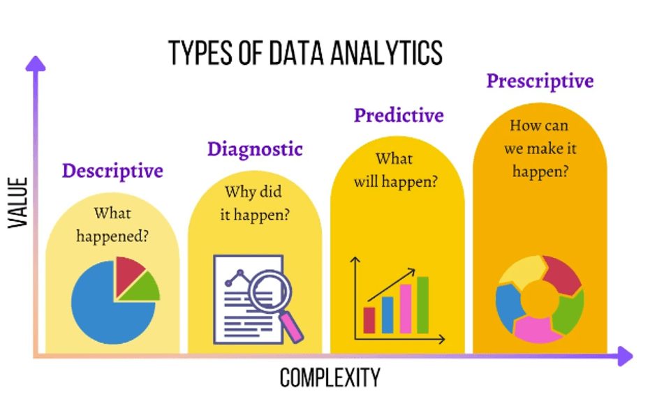

# Week 1 · Day 1 — Activity 1: Analytics in Action

**Duration:** 75 min (35 min work / 30 min slides / 10 final touches)
**Format:** Groups of 3–4

---

## The scenario

Your team has been hired as data consultants for an industry of your choice. Your job is to demonstrate how each of the four analytics types helps the organization make data-driven decisions and what data is needed to do it.

**Pick one industry:** retail, healthcare, ride-sharing, food delivery, airline, streaming platform, banking/fintech, or university admissions.

---

## Your task

For each analytics type, fill in the table below:

| Analytics type | Key question | Your business use case | A concrete question + the data needed | Data shape(s) | Source system |
| :--- | :--- | :--- | :--- | :--- | :--- |
| Descriptive | What happened? | | | | |
| Diagnostic | Why did it happen? | | | | |
| Predictive | What is likely to happen? | | | | |
| Prescriptive | What should we do about it? | | | | |

> [!NOTE]
> **Data shapes** refer to how data is organized:
> - **Structured** — rows and columns (e.g., relational DB tables, CSV files)
> - **Semi-structured** — flexible schema with tags or keys (e.g., JSON, XML, event logs)
> - **Unstructured** — no predefined format (e.g., free text, support chats, PDFs, images)

> [!TIP]
> **Example row (logistics/shipping — not on the pick list, shown as a model only):**
>
> | Analytics type | Key question | Your business use case | A concrete question + the data needed | Data shape(s) | Source system |
> | :--- | :--- | :--- | :--- | :--- | :--- |
> | Predictive | What is likely to happen? | Delivery delay prediction | Which shipments are likely to miss their SLA in the next 48 hours? Needs: shipment records, GPS event logs, driver notes | Structured, Semi-structured, Unstructured | Order management DB + Telematics API + Support ticketing system |
>
> Use this to calibrate the level of detail expected. Strong answers name real source systems (e.g., a billing DB, an event tracking API, a CRM) — not just "a database."

---

## Deliverable

- **2–3 slides** summarizing your four analytics questions and data requirements
- **5-minute group readout** — every member speaks
- Be ready to answer: *"Which of your data sources is structured vs semi-structured vs unstructured and why does that matter for how you store it?"*
