# AWS Glue Visual ETL: Building a Medallion Pipeline Without Code

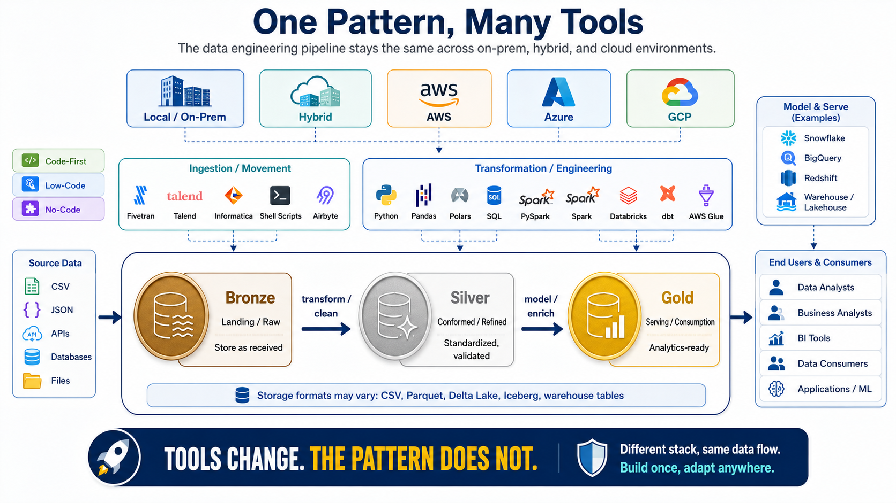

**Module:** Week 3, Day 5 (AWS Glue ETL)
**Estimated Time:** 90 to 120 minutes
**Difficulty:** Beginner to Intermediate
**Format:** Individual
**Prerequisites:** Week 1 Day 4 S3 lab completed (you already have your two buckets), AWS Console login

> [!WARNING]
> **AI-Free Zone (Weeks 1 to 4).** No AI assistants for this lab. The good news: today you barely write any code at all. That is the whole point.

## Objective

In this activity, you will build a two-stage ETL pipeline using **AWS Glue Studio Visual ETL**, a drag-and-drop job editor where you compose transformations as a diagram and Glue generates and runs the Apache Spark code for you. You will:

1. Build a **Bronze ingestion job** that copies raw NYC Taxi data from the shared course bucket into your own bucket.
2. Build a **Silver transformation job** that cleans, filters, joins, and reshapes the Bronze data and writes query-optimized Parquet.

You write zero lines of Spark. One small provided snippet gets pasted into a Custom Transform node so you can see the escape hatch Glue offers when the visual palette runs out.

## Background: The Medallion Architecture

The **medallion architecture** organizes a data lake into progressively refined layers:

| Layer | Also called | What lives here | Today |
|---|---|---|---|
| **Bronze** | Raw / landing | Data exactly as it arrived from the source. No cleaning, no opinions. If a downstream bug appears, you can always rebuild from Bronze. | Job 1 writes it |
| **Silver** | Cleansed / conformed | Validated, deduplicated, filtered, joined, consistently named and typed. The trustworthy layer analysts build on. | Job 2 writes it |
| **Gold** | Curated / business | Aggregates and business-level tables shaped for a specific use case or dashboard. | Stretch goal |

You already built the storage for this in Week 1 without knowing it. Your two buckets map directly onto the first two layers:

| Medallion layer | Your bucket | Prefix you will create |
|---|---|---|
| Bronze | `techcatalyst-de-2026-<username>-raw` | `bronze/nyc_taxi/...` |
| Silver | `techcatalyst-de-2026-<username>-processed` | `silver/nyc_taxi/...` |

Some teams use one bucket with `bronze/`, `silver/`, and `gold/` prefixes; others use one bucket per layer. Both are valid. The layer contract matters, not the folder layout.

### Why drag and drop?

You have been writing SQL all week, and you will write plenty of PySpark in Week 5. Visual ETL tools matter for a different reason: a large share of real-world pipelines are built and maintained by people who are not engineers, and even engineering teams use visual tools for standard ingest-and-clean work because they are faster to build, easier to hand over, and self-documenting. Glue Studio generates real Spark code underneath, and you will inspect it. Knowing when a visual tool is enough, and when it is not, is a design skill.

## The pipeline you are building

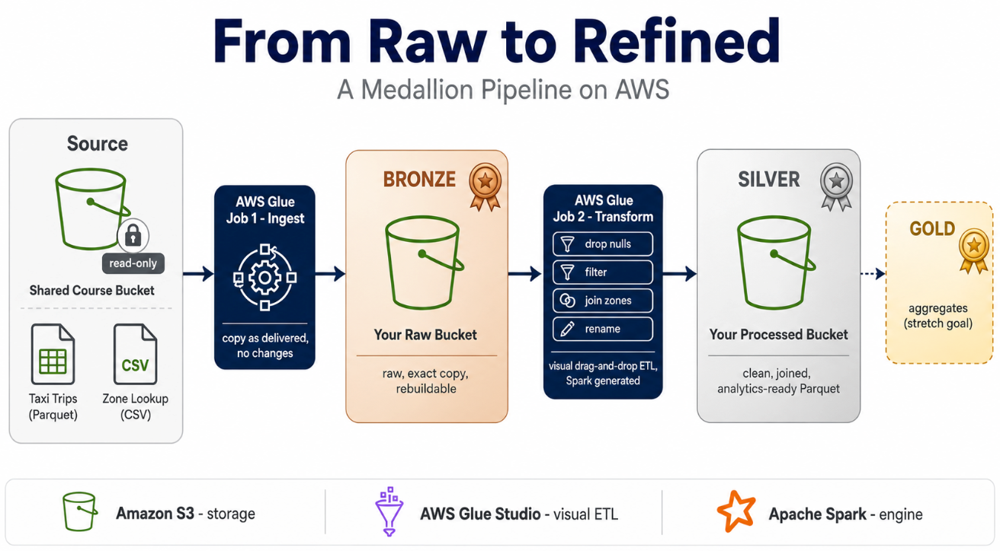

```text
s3://techcatalyst-de-2026/            (shared course bucket, read-only)
        |
        |  Job 1: Bronze Ingest (visual, source -> target)
        v
s3://techcatalyst-de-2026-<username>-raw/bronze/nyc_taxi/
        |
        |  Job 2: Silver Transform (clean -> filter -> join x2 -> rename -> write)
        v
s3://techcatalyst-de-2026-<username>-processed/silver/nyc_taxi/
```

The dataset is the NYC Taxi and Limousine Commission (TLC) yellow taxi trip records (Parquet) plus the taxi zone lookup table (CSV). See the [Registry of Open Data on AWS](https://registry.opendata.aws/nyc-tlc-trip-records-pds/).

## Lab Index

### Provided Files

| File | Purpose | Source |
|---|---|---|
| `README.md` (this file) | Full lab instructions | This repo |
| `images/` | Console screenshots | This repo |
| `s3://techcatalyst-de-2026/nyc-taxi/yellow-tripdata/` | Yellow taxi trip Parquet files | [NYC TLC Trip Record Data](https://www.nyc.gov/site/tlc/about/tlc-trip-record-data.page) |
| `s3://techcatalyst-de-2026/nyc-taxi/taxi_zone_lookup/taxi_zone_lookup.csv` | Zone lookup CSV | Same source |

### Deliverables

| # | Deliverable | Evidence |
|---|---|---|
| 1 | Bronze ingest job ran successfully | Screenshot of the green **Succeeded** run and of `bronze/` objects in your raw bucket |
| 2 | Silver transform job ran successfully | Screenshot of the run and of `silver/` Parquet objects in your processed bucket |
| 3 | Generated script inspected | One sentence in `student-work/week3/day5/glue_lab_notes.md` naming a transform node and the Spark function it generated |
| 4 | Medallion reasoning | Two or three sentences in the same notes file: what belongs in Bronze vs Silver and why |

> [!NOTE]
> Save notes and screenshots under `student-work/week3/day5/`. Nothing in this lab requires a local Python environment.

> [!NOTE]
> **Screenshots vs your screen.** Some screenshots below come from an earlier console version. Node names, tabs, and fields are the same, but colors and layout may differ slightly. One real difference is called out where it matters: we read directly from S3 paths, while some screenshots show a Data Catalog database and table. Follow the written steps; use the images for orientation.

---

# Part 0: Preflight (5 minutes)

1. Sign in to the AWS Console with your assigned classroom account. Confirm the region is **us-east-1** (top right).
2. Open **S3** and confirm both of your Week 1 buckets exist: `techcatalyst-de-2026-<username>-raw` and `techcatalyst-de-2026-<username>-processed`.
3. Open **S3** and confirm you can see the shared course bucket content: navigate to `techcatalyst-de-2026` and look inside `nyc-taxi/`. You should see `yellow-tripdata/` (Parquet files) and `taxi_zone_lookup/` (one CSV). You have read-only access; do not try to modify it.
4. Open the **AWS Glue** console: search for "Glue" in the top search bar. In the left navigation, under **ETL jobs**, click **Visual ETL**.

> [!IMPORTANT]
> **Naming.** The classroom shares one AWS account, so every job name must include your username. Follow the exact names given in each step. The IAM role you will select for every job and every data preview is **`AWSGlueServiceRole-TechCatalyst`**. It was created for you; you do not create any IAM resources today.

---

# Part 1: Bronze Ingestion Job (25 minutes)

Bronze is a faithful copy of the source. This job has no transforms at all: two sources, two targets. That is deliberate. Ingestion and transformation are separate concerns, and keeping them in separate jobs means you can re-run one without the other.

## Create the job

1. On the Visual ETL page, click **Visual ETL** under Create job to open a blank canvas.

   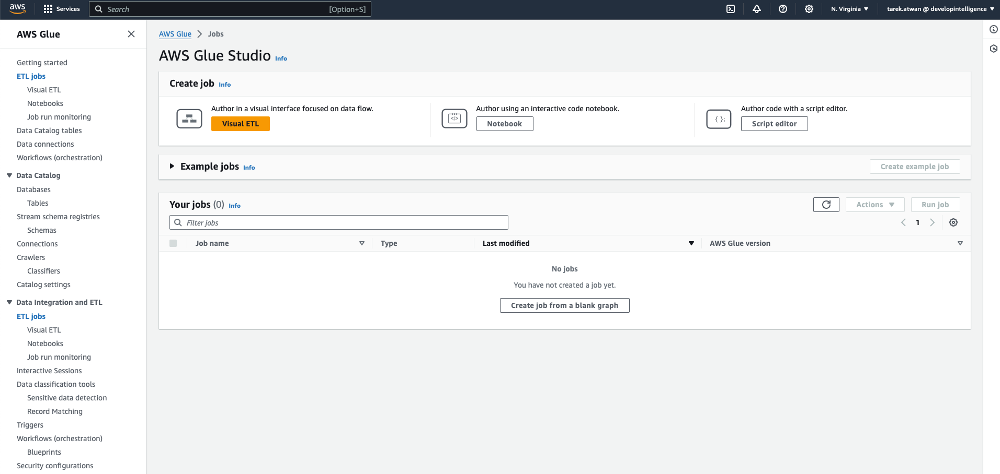

2. Go to the **Job details** tab and set:

   - **Name**: `<username>_bronze_ingest` (example: `tatwan_bronze_ingest`)
   - **IAM Role**: `AWSGlueServiceRole-TechCatalyst`
   - **Glue version**: **Glue 5.1** (pick the highest version offered)
   - **Worker type**: **G 1X**
   - **Requested number of workers**: `2`
   - **Job bookmark**: **Disable**
   - **Number of retries**: `0`
   - **Job timeout**: `30` minutes

   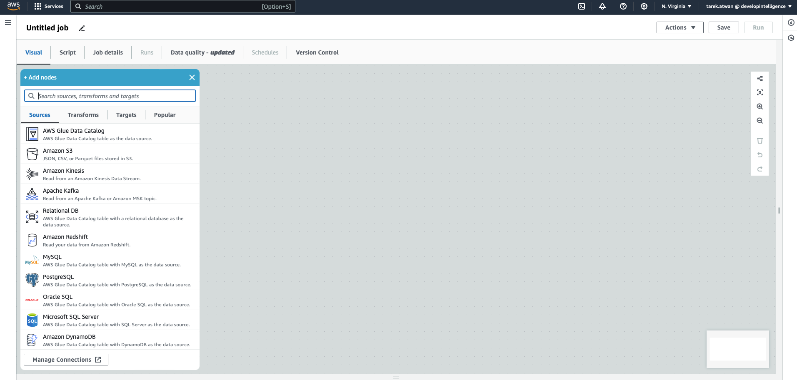

   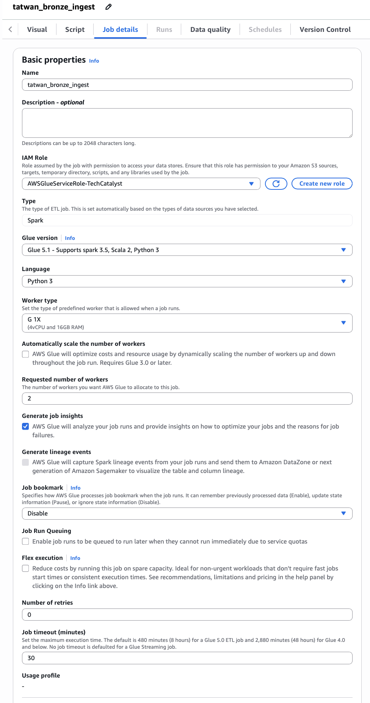

3. Click **Save**, then return to the **Visual** tab.

> [!NOTE]
> **Why these settings matter (and what they cost).** Glue bills per worker per minute (DPU-hours). Two G.1X workers is the minimum for a Spark job and is plenty for this dataset; the default is larger, which wastes money. **Job bookmark** tracks already-processed data so scheduled re-runs skip it; we disable it so your reruns behave predictably while you learn. **Retries 0** means a broken job fails fast instead of silently billing you three attempts.

## Branch 1: Yellow trip data

4. Click the **+** (Add nodes) button, and under the **Sources** tab choose **Amazon S3**.

   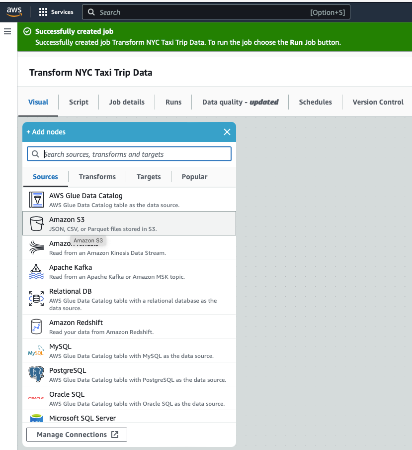

5. Select the new node and set its properties:

   - Node properties tab, **Name**: `Yellow Trip Data (Course Bucket)`
   - Data source properties tab, **S3 source type**: **S3 location**
   - **S3 URL**: `s3://techcatalyst-de-2026/nyc-taxi/yellow-tripdata/`
   - **Data format**: **Parquet**
   - Click **Infer schema**

6. Check the **Output schema** tab on the node. You should see the trip columns (`vendorid`, `tpep_pickup_datetime`, `passenger_count`, `fare_amount`, and so on). If the schema is empty, re-check the S3 URL and click **Infer schema** again.

   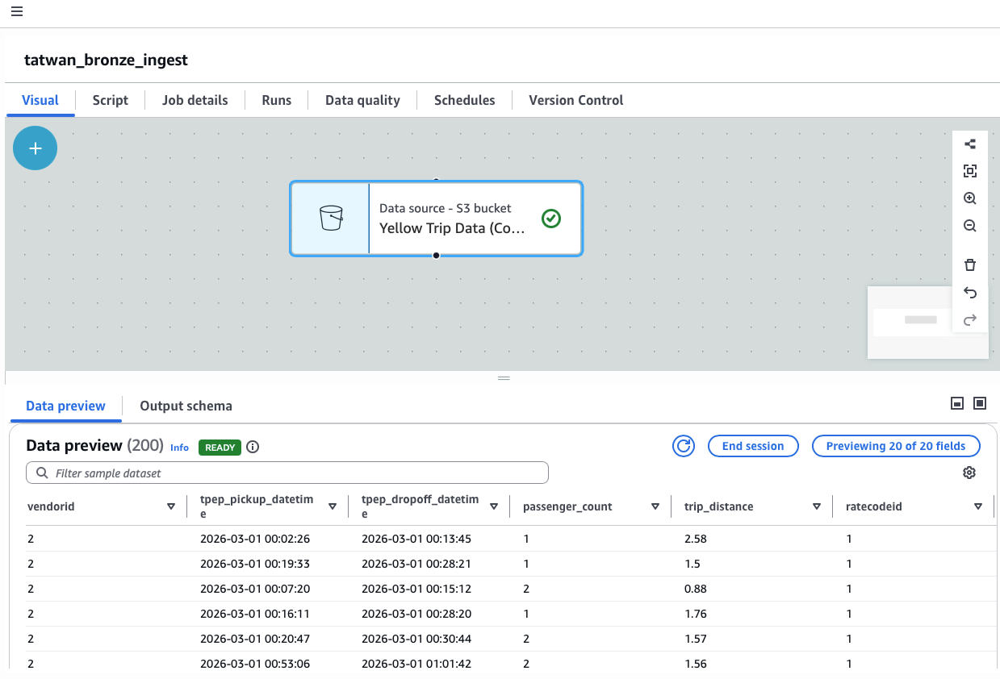

7. With the source node selected, click **+** and under **Targets** choose **Amazon S3**. Set:

   - Node properties tab, **Name**: `Bronze - Yellow Trip Data`
   - **Format**: **Parquet**
   - **Compression Type**: **Snappy**
   - **S3 Target Location**: `s3://techcatalyst-de-2026-<username>-raw/bronze/nyc_taxi/yellow_tripdata/`
   - **Data Catalog update options**: **Do not update the Data Catalog**

8. Click **Save**.

## Branch 2: Taxi zone lookup

9. Click **+** and add a second **Amazon S3 source** (it will not be connected to the first branch; that is fine, one job can carry independent branches):

   - Node properties tab, **Name**: `Taxi Zone Lookup (Course Bucket)`
   - **S3 URL**: `s3://techcatalyst-de-2026/nyc-taxi/taxi_zone_lookup/`
   - **Data format**: **CSV**
   - **Delimiter**: comma
   - **Quote character**: double quote `"`
   - Confirm the first-row-is-header option is enabled
   - Click **Infer schema**

10. Check its **Output schema**: four columns, `locationid`, `borough`, `zone`, `service_zone`. If every value later shows up wrapped in `"` quotes, you missed the quote character setting.

11. With that source selected, add an **Amazon S3 target**:

    - Node properties tab, **Name**: `Bronze - Taxi Zone Lookup`
    - **Format**: **CSV**
    - **S3 Target Location**: `s3://techcatalyst-de-2026-<username>-raw/bronze/nyc_taxi/taxi_zone_lookup/`
    - **Data Catalog update options**: **Do not update the Data Catalog**

12. Click **Save**.

> [!NOTE]
> **Why keep the lookup as CSV in Bronze?** Bronze preserves the source as delivered. The Parquet trip data stays Parquet; the CSV lookup stays CSV. Format opinions belong to Silver. Also note: because Spark performs this copy, the Bronze files will not be byte-identical to the source files (Spark rewrites and may split them). Production landing zones often use a plain S3 copy for exactly this reason; we use a Glue job today so your very first visual job is a safe one.

## Run it

13. Click **Run** (top right).

    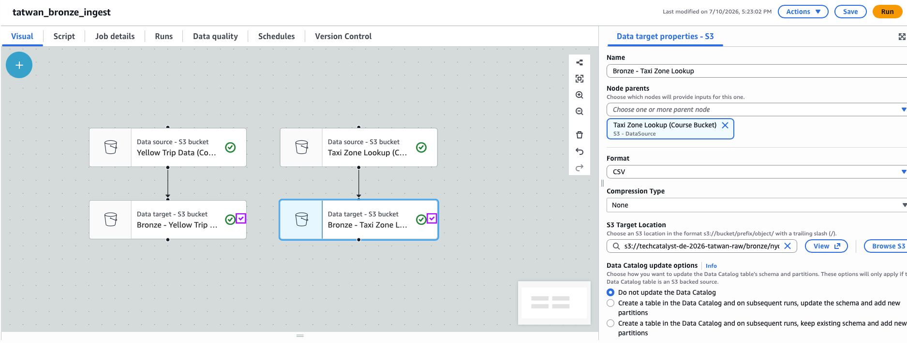

14. Go to the **Runs** tab and watch the status. First runs take 2 to 4 minutes including Spark startup.

    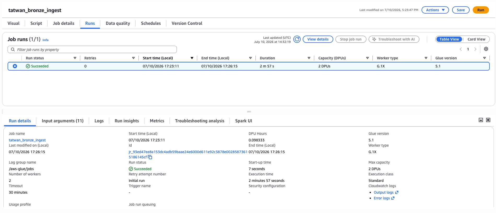

15. When the run shows **Succeeded**, open S3 and verify objects now exist under both Bronze prefixes in your raw bucket. 

<details>
<summary>Hint: The run failed with an S3 access error</summary>
Check the exact spelling of your bucket name and the target prefix. If the path is right, confirm you selected the `AWSGlueServiceRole-TechCatalyst` role on the Job details tab, then ask the instructor: role permissions are an environment issue, not something you can fix.
</details>

<details>
<summary>Hint: Infer schema shows nothing or errors</summary>

The S3 URL must end with a trailing `/` and point at the folder, not a single file. Also confirm the Data format matches (Parquet for trips, CSV for the lookup).
</details>

---

# Part 2: Silver Transformation Job (50 minutes)

Now the real ETL. Plan first, click second. Based on what the 2025 cohort found exploring this data, the Silver contract is:

1. Read the yellow trip data from **your Bronze**, not from the course bucket. Bronze is now your source of truth.
2. Remove records with NULL values (`vendorid`, `passenger_count`, `ratecodeid`, `payment_type` all have NULL rows).
3. Filter out voided or bad trips (business rule: drop `payment_type = 3`, the No Charge trips).
4. Join with the zone lookup to translate the numeric `pulocationid` (pickup) into a borough and zone name.
5. Join with the zone lookup again for `dolocationid` (dropoff).
6. Rename inconsistent columns, then drop the now-redundant numeric IDs.
7. Write Snappy-compressed Parquet to your Silver prefix.

## Create the job

1. From **Visual ETL**, create a second job. On the **Job details** tab use exactly the same settings as Part 1, except:

   - **Name**: `<username>_silver_transform`

2. Click **Save** and return to the **Visual** tab.

## Add the Bronze trip data source

3. Add an **Amazon S3 source**:

   - Node properties tab, **Name**: `Bronze Yellow Trip Data`
   - **S3 URL**: `s3://techcatalyst-de-2026-<username>-raw/bronze/nyc_taxi/yellow_tripdata/`
   - **Data format**: **Parquet**
   - Click **Infer schema**

4. Optional but recommended once per job: open the **Data preview** tab. When prompted for a role, choose `AWSGlueServiceRole-TechCatalyst`. The preview spins up a small interactive session (this bills while it runs, so preview with intent, not on every node) and shows sample rows after 20 to 30 seconds.

   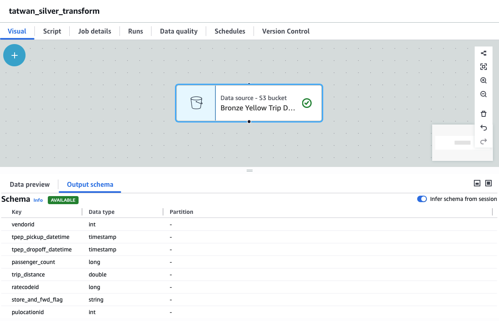

## Remove records with NULL values

There is no palette node for "drop any row containing a NULL", so this is the one place you paste code. Glue Studio's **Custom Transform** node accepts a small PySpark function and drops it into the generated script. Paste it, read it, move on.

5. With the source node selected, click **+**, and under **Transforms** choose **Custom Transform**.

   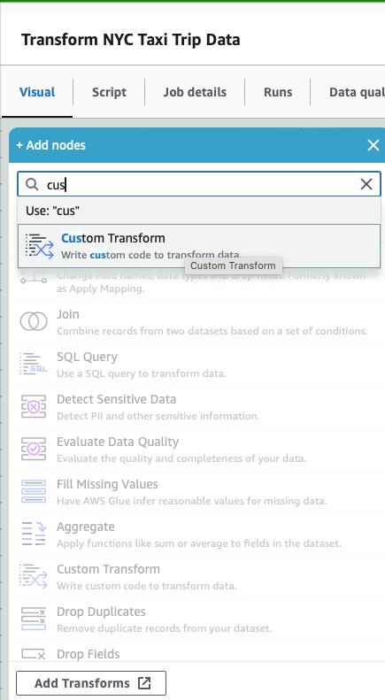

6. Set its properties:

   - Node properties tab, **Name**: `Remove Records with NULL`
   - **Code block**:

     ```python
     def MyTransform (glueContext, dfc) -> DynamicFrameCollection:
         df = dfc.select(list(dfc.keys())[0]).toDF().na.drop()
         results = DynamicFrame.fromDF(df, glueContext, "results")
         return DynamicFrameCollection({"results": results}, glueContext)
     ```

   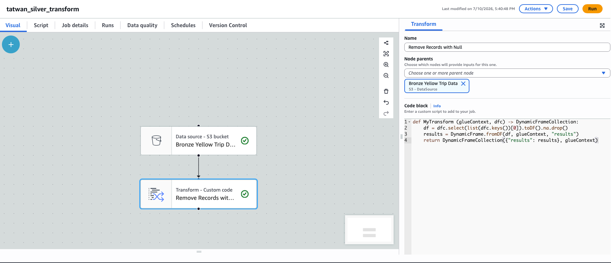

   Reading it: convert to a Spark DataFrame, call `na.drop()` (drop every row containing any NULL), convert back. That is all.

7. A Custom Transform returns a *collection* of frames, so Glue requires one more node to pick a frame out of it. With the Custom Transform selected, add the **SelectFromCollection** transform:

   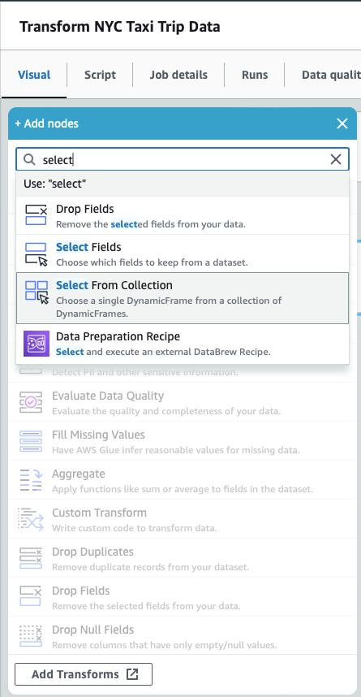

   - Node properties tab, **Name**: `SelectFromCollection`
   - Transform tab, **Frame index**: `0`

   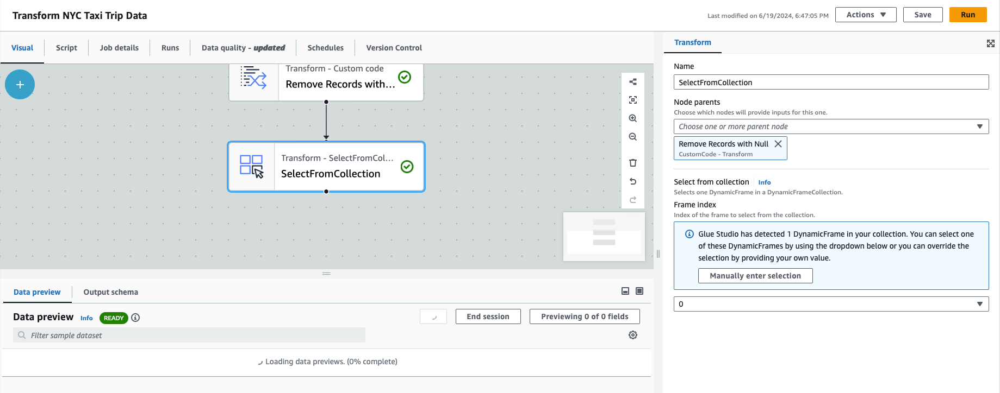

8. Click **Save**.

## Filter out No Charge trips

9. With `SelectFromCollection` selected, add a **Filter** transform:

   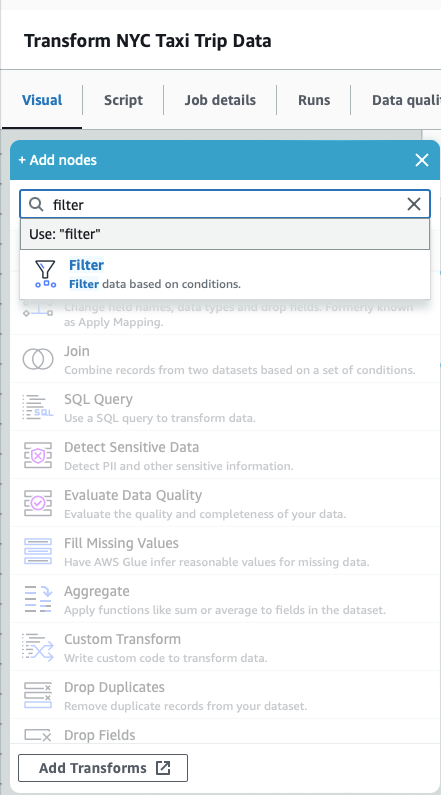

   - Node properties tab, **Name**: `Filter - Yellow Trip Data`
   - Transform tab, **Filter condition**: `payment_type` `!=` `3`

   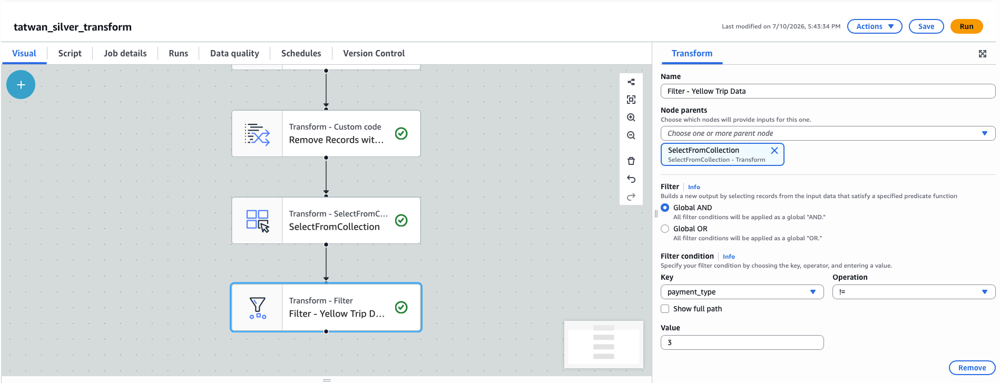

10. Click **Save**.

## Look at the code you did not write

11. Open the **Script** tab. Every node you placed is now generated PySpark. Find your Custom Transform snippet and the Filter. This is Deliverable 3: note one node and its generated function in your notes file.

    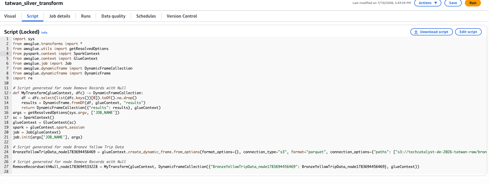

## Add the zone lookup and prepare it for the pickup join

12. Back on the **Visual** tab, add another **Amazon S3 source** (unconnected for now):

    - Node properties tab, **Name**: `Zone Lookup`
    - **S3 URL**: `s3://techcatalyst-de-2026-<username>-raw/bronze/nyc_taxi/taxi_zone_lookup/`
    - **Data format**: **CSV**, comma delimiter, header row enabled
    - Click **Infer schema**

13. Both joins need this lookup, but each side must have distinct column names (you cannot have two columns named `borough` after joining twice). So: with `Zone Lookup` selected, add a **Change Schema** transform (formerly called Apply Mapping):

    - Node properties tab, **Name**: `ApplyMapping - Pickup Zone Lookup`
    - Transform tab, change the **Target key** of each column:
      - `locationid` to `pu_location_id`
      - `borough` to `pu_borough`
      - `zone` to `pu_zone`
      - `service_zone` to `pu_service_zone`

    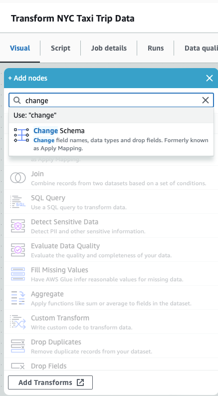

    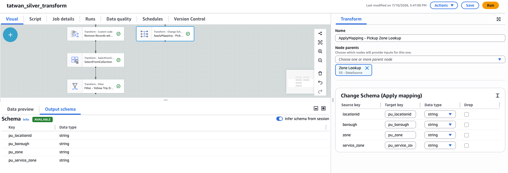

14. Click **Save**.

## Join 1: trips + pickup zone

15. Add a **Join** transform and configure:

    - Node properties tab, **Name**: `Trips + Pickup Zone`
    - Node properties tab, **Node parents**: check both `Filter - Yellow Trip Data` and `ApplyMapping - Pickup Zone Lookup`

    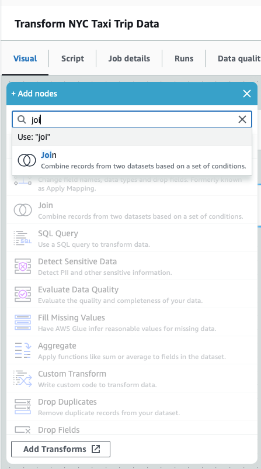

    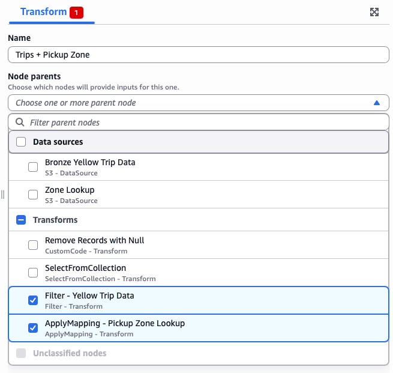

    - Transform tab, **Join type**: Inner join
    - **Join conditions**: `pulocationid` (from the Filter side) `=` `pu_location_id` (from the ApplyMapping side)

    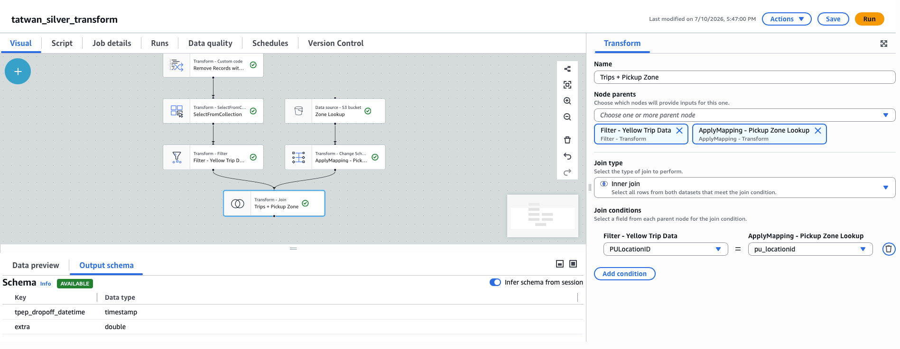

16. Click **Save**.

## Join 2: + dropoff zone

The dropoff side is the same idea. One nice trick: a single source node can feed multiple children, so you reuse the `Zone Lookup` source instead of adding it again.

17. Select the `Zone Lookup` **source** node (not the pickup ApplyMapping) and add a second **Change Schema** transform:

    - Node properties tab, **Name**: `ApplyMapping - Dropoff Zone Lookup`
    - Rename: `locationid` to `do_location_id`, `borough` to `do_borough`, `zone` to `do_zone`, `service_zone` to `do_service_zone`

    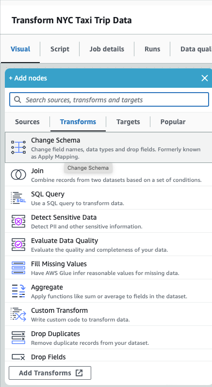

    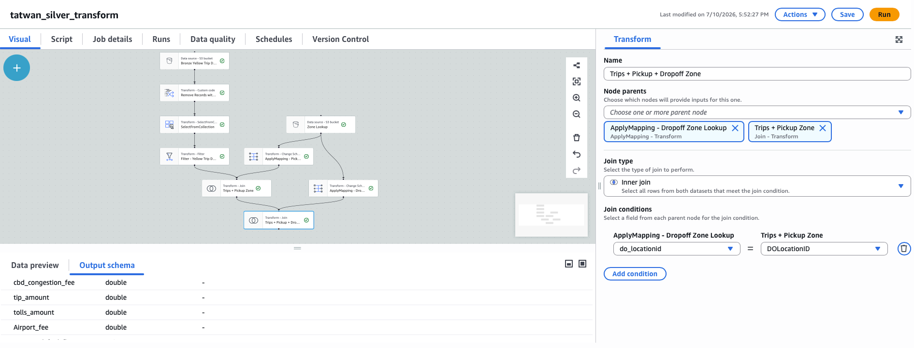

18. Add another **Join**:

    - Node properties tab, **Name**: `Trips + Pickup + Dropoff Zone`
    - **Node parents**: `Trips + Pickup Zone` and `ApplyMapping - Dropoff Zone Lookup`
    - **Join conditions**: `dolocationid` `=` `do_location_id`

19. Click **Save**.

## Final cleanup: rename and drop columns

20. With the second join selected, add a final **Change Schema** transform:

    - Node properties tab, **Name**: `ApplyMapping - Final`
    - Rename **Target key**: `vendorid` to `vendor_id`
    - **Drop** these source keys (check the Drop box): `pulocationid`, `dolocationid`

    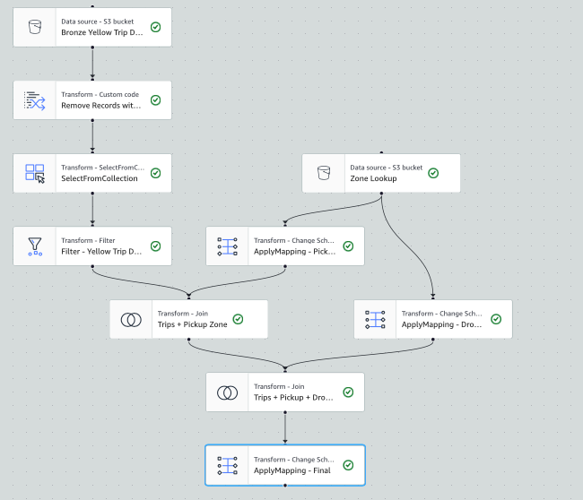

    

    The numeric location IDs did their job in the joins; the human-readable borough and zone columns replace them in Silver.

## Write to Silver

21. Add an **Amazon S3 target**:

    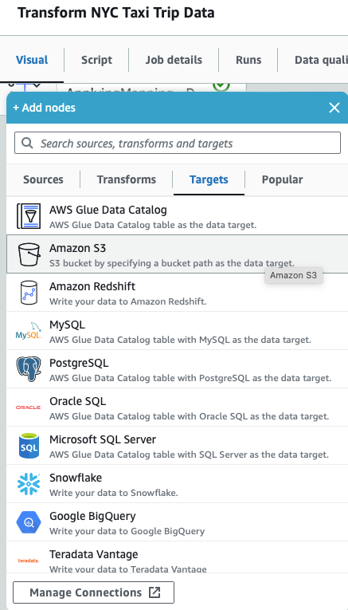

    - Node properties tab, **Name**: `Silver - Yellow Trip Data`
    - **Format**: **Parquet**
    - **Compression Type**: **Snappy**
    - **S3 Target Location**: `s3://techcatalyst-de-2026-<username>-processed/silver/nyc_taxi/yellow_tripdata/`
    - **Data Catalog update options**: **Do not update the Data Catalog**

    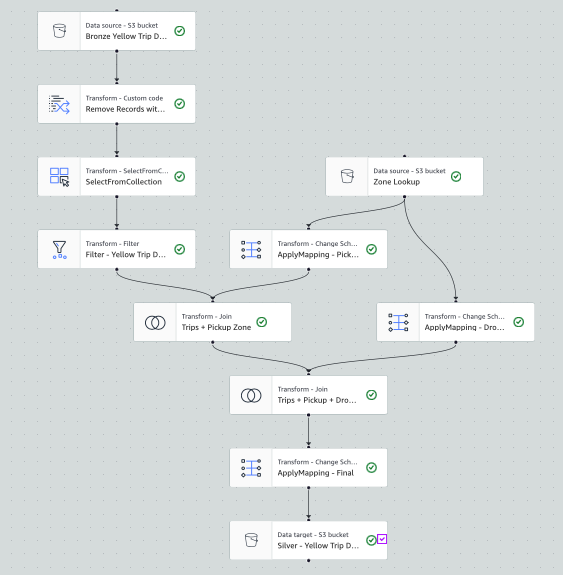

22. Click **Save**. Your canvas should now show one continuous flow: source, custom transform, select, filter, two mapping+join pairs, final mapping, target.

## Run and monitor

23. Click **Run**, then open the **Runs** tab. This job does real work, so expect several minutes. Click the **Metrics** to see details and metrics.

    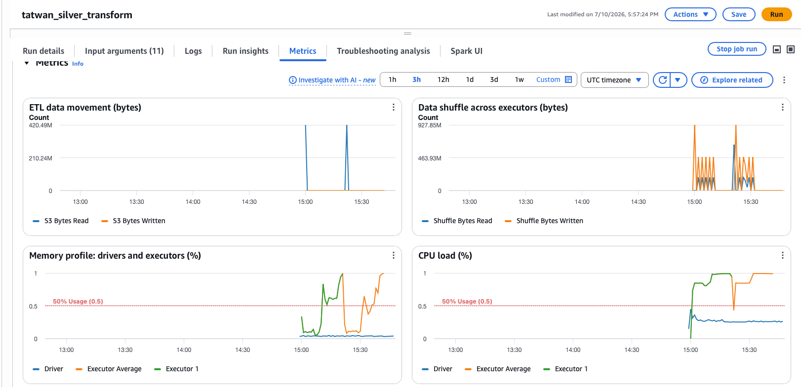

24. When it succeeds, open your processed bucket in S3 and inspect `silver/nyc_taxi/yellow_tripdata/`. You should see multiple Snappy Parquet part files

    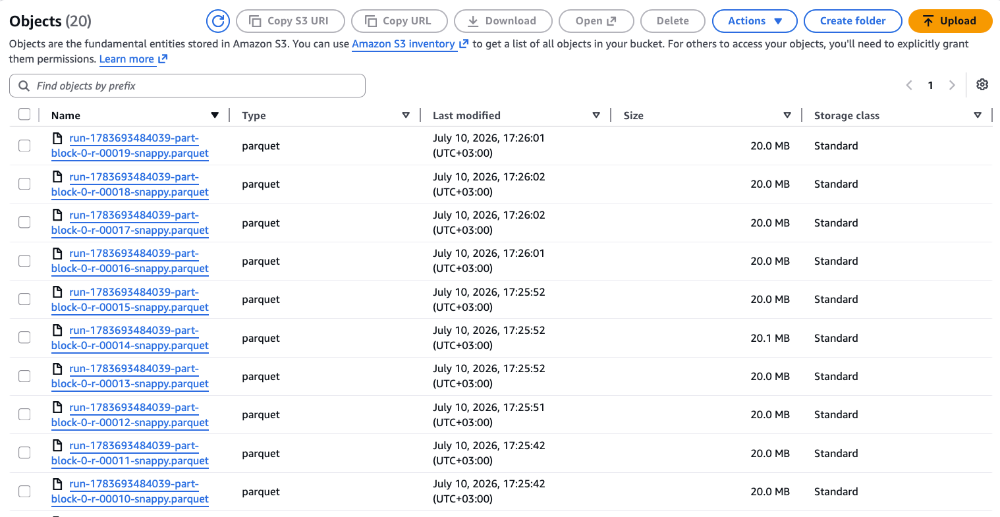

25. Take your Deliverable 2 screenshots and finish your notes file (Deliverables 3 and 4).

<details>
<summary>Hint: The Join transform will not let me pick the second parent</summary>
A Join needs exactly two parents. Select the Join node, open Node properties, and use the Node parents dropdown to check both upstream nodes. If you accidentally chained the ApplyMapping under the wrong parent, change its parent the same way.
</details>

<details>
<summary>Hint: My joined data has doubled or zero rows</summary>
Check the join keys. `pulocationid = pu_location_id` for pickup and `dolocationid = do_location_id` for dropoff. Swapped or reused keys are the most common mistake in this lab. Use Data preview on the join node to sanity-check before running the whole job.
</details>

<details>
<summary>Hint: The job ran but Silver is empty</summary>
Look at the target node's S3 path for a typo (a wrong bucket name fails; a wrong prefix silently writes elsewhere). Then check the Runs tab error log link (CloudWatch) for the real error message.
</details>

---

# Cleanup and Cost Notes (5 minutes)

- Data preview sessions bill while active. If you opened one, it stops on its own after idle timeout, but close the job editor tab when you finish.
- Do not re-run jobs in a loop "to see it again". Each run bills worker-minutes.
- Leave your Bronze and Silver data in place: Week 8 capstone discussions reference it. Do not delete the jobs either; the instructor reviews them.

# Success Criteria

- Your Bronze prefixes contain the trip Parquet files and the lookup CSV, copied by a Glue job you built.
- Your Silver prefix contains Snappy Parquet with: no NULL rows, no `payment_type = 3` rows, pickup and dropoff borough/zone columns present, `vendor_id` renamed, and no `pulocationid`/`dolocationid` columns.
- You can point at the generated script and identify which node produced which code.
- You can explain, in two sentences, why the NULL-drop and the joins belong in Silver and not in Bronze.
- You used no AI assistance. (You also wrote no code, which is the lesson.)

# Stretch Goals

- **Gold layer**: add a third job using the **SQL Query** transform node on your Silver data to produce a small aggregate (for example, average `total_amount` by `pu_borough`), written to `gold/` in your processed bucket. That completes the medallion.
- **Partitioned Silver**: in the S3 target node, add a partition key (for example a date-derived column) and observe how the output folder structure changes. Recall the partition pruning cost demo from BigQuery earlier today; this is the same idea on S3.
- **Compare**: open the generated script and estimate how many lines of PySpark you avoided writing. Would you rather maintain the diagram or the script? Defend your answer to a partner.
