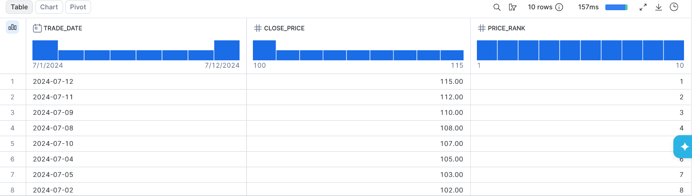
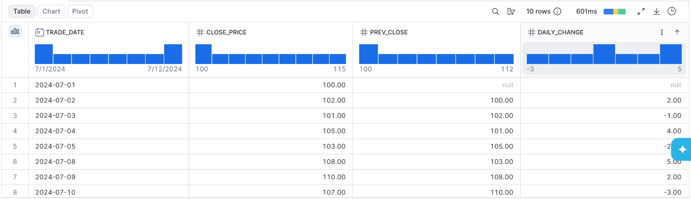
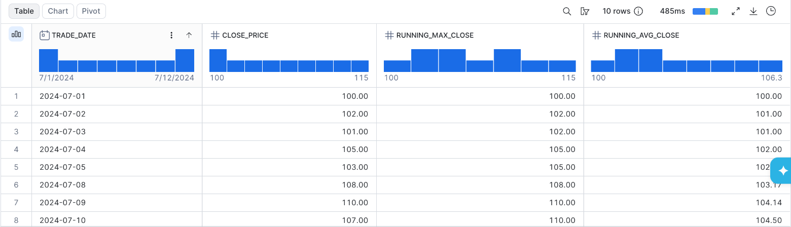
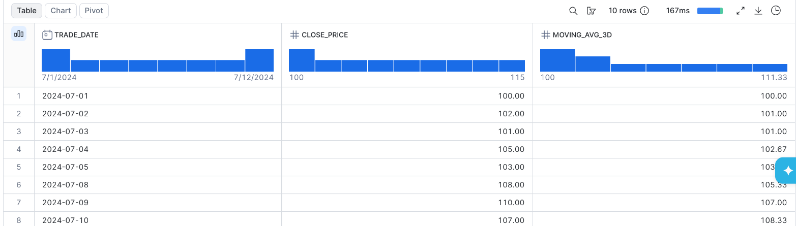
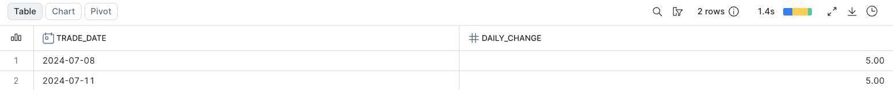
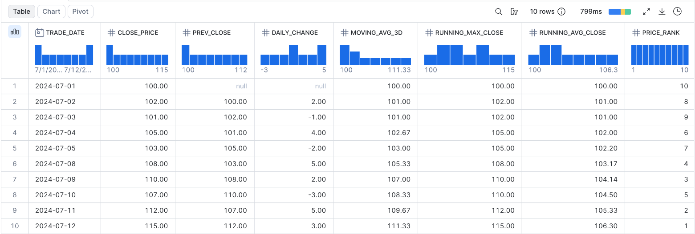
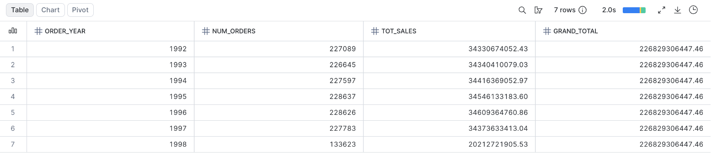
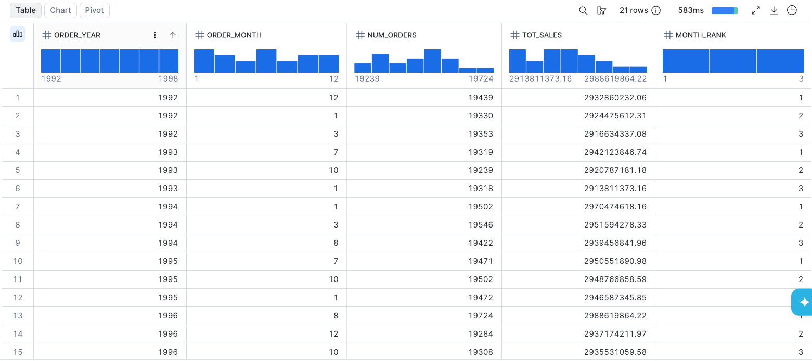

# Activity 4: Window Functions

**Module:** Week 5 Day 1  
**Estimated Time:** 60 to 75 minutes  
**Difficulty:** Intermediate  
**Format:** Individual, then partner explanation  
**Prerequisites:** Comfortable with `GROUP BY` and CTEs from Week 4

## Objective

Learn the window functions you will reach for constantly: ranking, comparing a row with its neighbors, and accumulating values over an ordered series. You will practice on a tiny, hand-checkable stock-price table, then apply the same ideas to TPC-H sales.

## The key idea

`GROUP BY` collapses many rows into one. A window function keeps every row but adds a value computed over a related set of rows (the window). You choose the window with `OVER (PARTITION BY ... ORDER BY ... frame)`.

- `PARTITION BY` splits rows into groups (like `GROUP BY`, but rows stay).
- `ORDER BY` inside `OVER` orders rows within the partition, which ranking, `LAG`/`LEAD`, and running totals need.
- A frame like `ROWS BETWEEN 2 PRECEDING AND CURRENT ROW` limits the window to nearby rows (moving averages).

## Setup (copy into Snowsight, run once)

```sql
USE ROLE DE;
USE WAREHOUSE COMPUTE_WH;
USE DATABASE TECHCATALYST;
USE SCHEMA TECHCATALYST.<YOUR_NAME>;

CREATE OR REPLACE TRANSIENT TABLE W5D1_STOCK (
  trade_date DATE,
  close_price NUMBER(10, 2)
);

INSERT INTO W5D1_STOCK (trade_date, close_price) VALUES
  ('2024-07-01', 100),
  ('2024-07-02', 102),
  ('2024-07-03', 101),
  ('2024-07-04', 105),
  ('2024-07-05', 103),
  ('2024-07-08', 108),
  ('2024-07-09', 110),
  ('2024-07-10', 107),
  ('2024-07-11', 112),
  ('2024-07-12', 115);

SELECT COUNT(*) AS trading_days FROM W5D1_STOCK;  -- 10
```

## Part A: Window drills on the stock table

Write each query in a worksheet. Predict the result before you run it.

| Drill | Question | Window tool |
|---|---|---|
| W1 | Rank the trading days by close price, highest first. | `DENSE_RANK() OVER (ORDER BY close_price DESC)` |
| W2 | For each day, show the previous day's close and the daily change. | `LAG(close_price) OVER (ORDER BY trade_date)` |
| W3 | Show a running maximum close and a running average close over time. | `MAX(...)` / `AVG(...) OVER (ORDER BY trade_date)` |
| W4 | Show a 3-day moving average of the close. | `AVG(...) OVER (ORDER BY trade_date ROWS BETWEEN 2 PRECEDING AND CURRENT ROW)` |
| W5 | Which day or days had the biggest single-day gain? | Build daily change first (a CTE), then keep the maximum. |
| W6 | Combine everything above into a single query: close price, previous close, daily change, 3-day moving average, running max, running average, and rank — all in one result set, ordered by trade_date. | Multiple `OVER()` clauses in one `SELECT` |

### **W1**



### W2



### W3



### W4



### W5



### W6

Combine everything above into a single query — for each trading day, show close price, previous close, daily change, 3-day moving average, running max, running average, and rank — all in one result set.



## Part B: TPC-H stretch (window over an aggregate)

Switch to read-only sample data. These show that a window function can wrap an aggregate.

```sql
USE SCHEMA SNOWFLAKE_SAMPLE_DATA.TPCH_SF1;
```

| Drill | Question | Hint |
|---|---|---|
| S1 | Per order year: order count, total sales, and the grand total of sales across all years on every row. | `SUM(SUM(o_totalprice)) OVER ()` |
| S2 | The top 3 months by total sales within each year. | Aggregate to year and month in a CTE, then `RANK() OVER (PARTITION BY year ORDER BY total_sales DESC)`, keep rank <= 3. |

### S1




### S2


