# Activity 5: Time Series Window Drills (SQL)

**Module:** Week 5 Day 1
**Estimated Time:** 40 to 50 minutes
**Difficulty:** Intermediate
**Format:** Individual, partner check at each checkpoint
**Prerequisites:** Activity 4 complete, Demo 2 watched

## Objective

Real tables, real questions, your own SQL. You just watched the instructor drive these moves; now you write them yourself on the three shared datasets in `TECHCATALYST.STOCKS`, all read-only, all already loaded:

| Table | Shape | Story |
|---|---|---|
| `GOOGLE_STOCKS` | 624 rows: DATE, CLOSE | One clean daily price series |
| `CLOSING_PRICE` | 504 rows: DATE, AAPL, MSFT, IBM | Three series trapped in wide columns |
| `MILK_PRODUCTION` | 168 rows: MONTH, PRODUCTION | The classic seasonal series, 1962 to 1975 |

Keep this activity open next to Activity 6: every question here gets asked again there, in pandas, and your two sets of answers must agree.

## Setup

```sql
USE ROLE DE;
USE WAREHOUSE COMPUTE_WH;
USE SCHEMA TECHCATALYST.STOCKS;

SELECT COUNT(*) FROM GOOGLE_STOCKS;    -- 624
SELECT COUNT(*) FROM CLOSING_PRICE;    -- 504
SELECT COUNT(*) FROM MILK_PRODUCTION;  -- 168
```

## Part 1: Google, one series

| Drill | Question | Window tool |
|---|---|---|
| G1 | Each day's close, the previous close, the daily change, and the percent change (round 2). | `LAG(close) OVER (ORDER BY date)` |
| G2 | A 30-day moving average (round 2) and a running maximum of the close. | frame `ROWS BETWEEN 29 PRECEDING AND CURRENT ROW`; running max needs no frame |
| G3 | The single best day: the row where the daily change is the largest. HINT: consider using `CTE` | `QUALIFY daily_change = MAX(daily_change) OVER ()` |

### G1

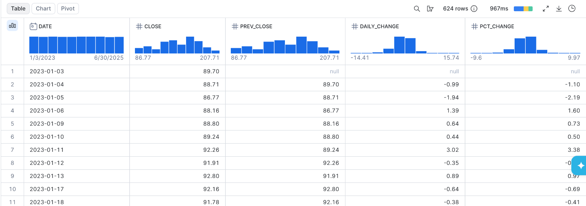

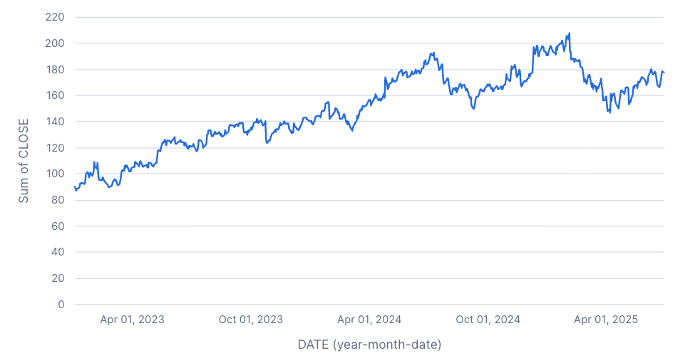

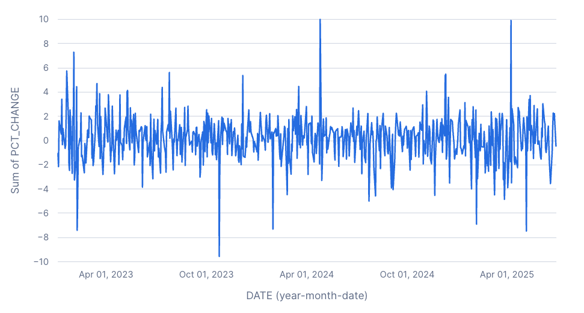


### G2

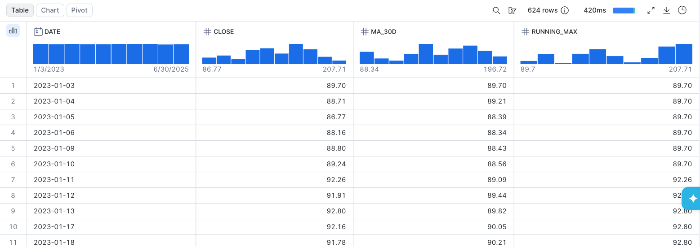

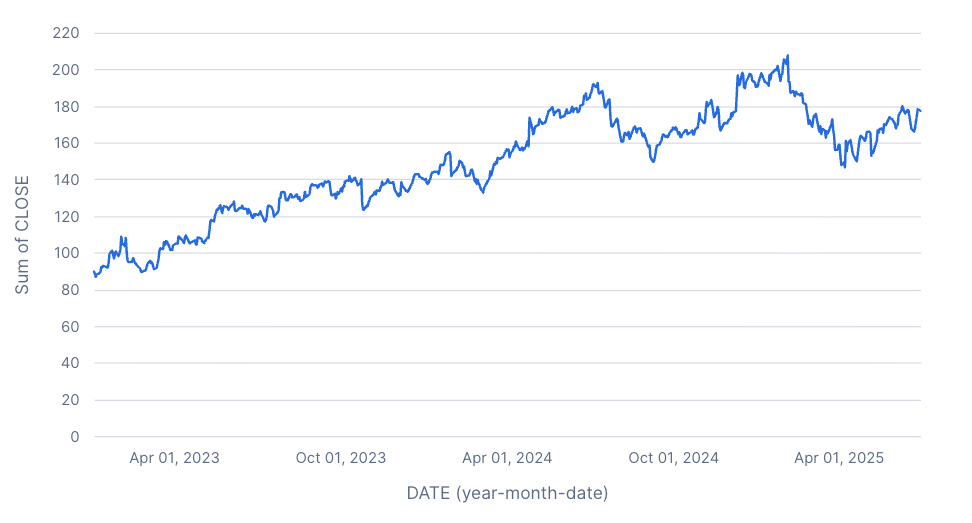

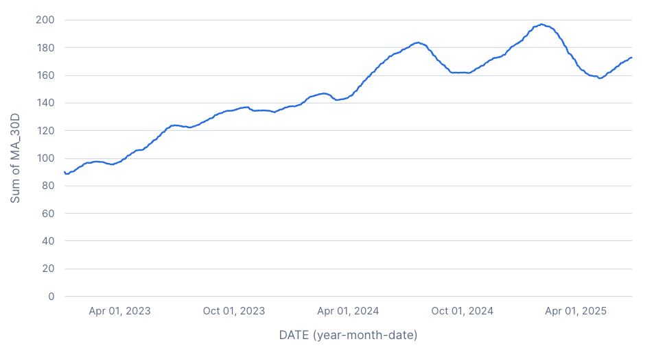

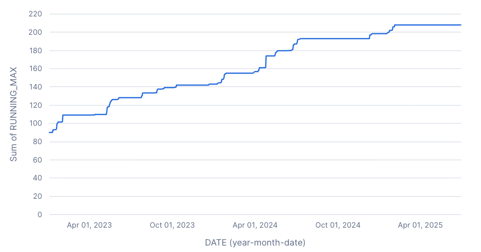

### G3

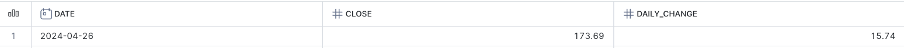

## Part 2: Three symbols, one wide table

`SELECT * FROM CLOSING_PRICE LIMIT 5;` and say out loud what blocks a per-company window here. Then fix the shape and drill.

| Drill | Question | Window tool |
|---|---|---|
| W1 | Reshape wide to long: one row per date per symbol. | `UNPIVOT (close FOR symbol IN (AAPL, MSFT, IBM))` |
| W2 | Daily change per symbol. | `LAG(...) OVER (PARTITION BY symbol ORDER BY date)` |
| W3 | 30-day moving average per symbol (round 2). | the Part 1 frame plus `PARTITION BY` |
| W4 | Each symbol's 3 best closing days. One statement on the reshaped rows. | `QUALIFY RANK() OVER (PARTITION BY symbol ORDER BY close DESC) <= 3` |

The reshape and the windows are two genuine grains, so a CTE holding the long shape is the honest structure for W2 to W4 (Week 4 rule: the intermediate is reused, so it earns its name).

### SQL scaffold

```sql
-- W1: date, symbol, close from the UNPIVOT. Order by date, symbol. Count the rows.

-- W2: date, symbol, close, daily_change. Order by symbol, date.

-- W3: add ma_30d to W2.

-- W4: date, symbol, close for the top 3 days per symbol. Order by symbol, close DESC.
```

### W1

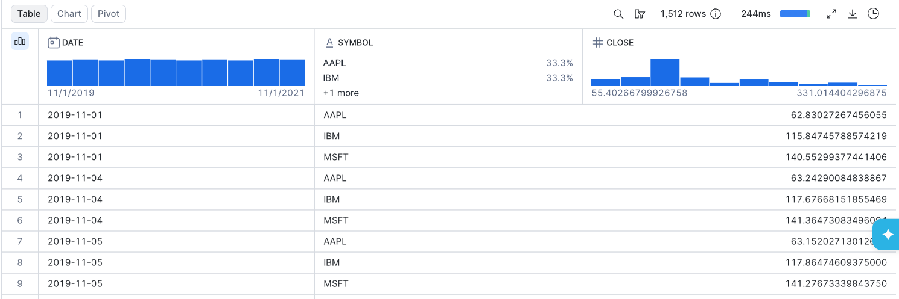

### W2

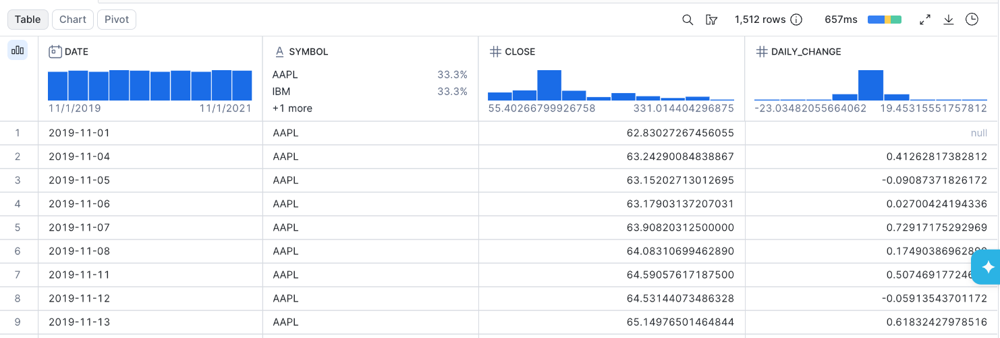

### W3

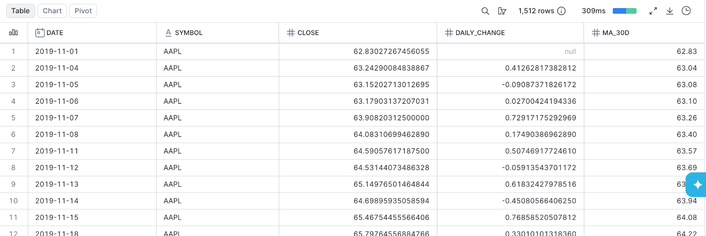


### W4

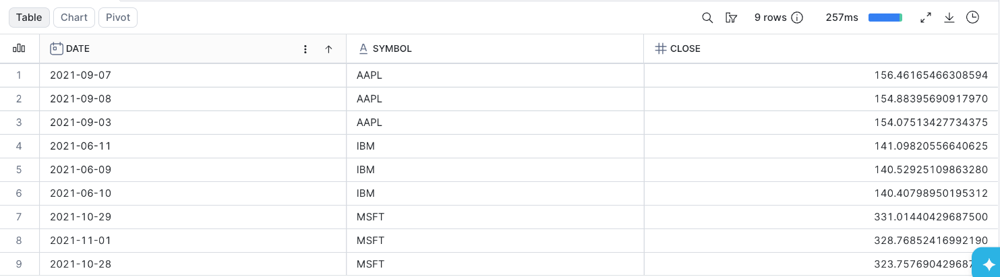

## Part 3: Seasonality

| Drill | Question | Window tool |
|---|---|---|
| M1 | Each month's production, the same month last year, and the year-over-year change. | `LAG(production, 12) OVER (ORDER BY month)` |
| M2 | A 12-month moving average (round 1). | frame `ROWS BETWEEN 11 PRECEDING AND CURRENT ROW` |

### SQL scaffold

```sql
-- M1: month, production, same_month_last_year, yoy_change. Order by month.

-- M2: add ma_12m. Then chart PRODUCTION and MA_12M together in Snowsight.
```

### M1 & M2 combined 

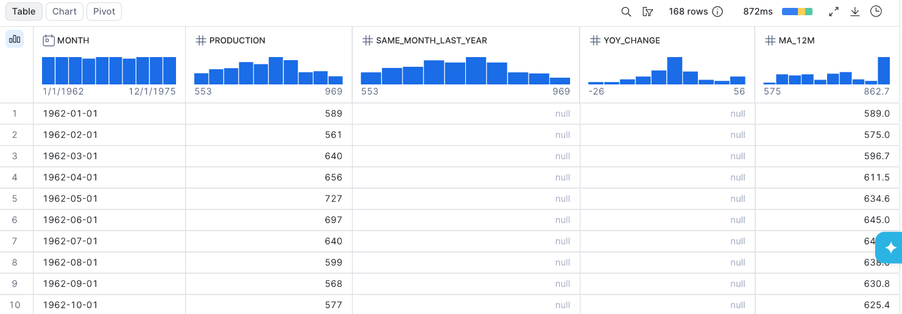


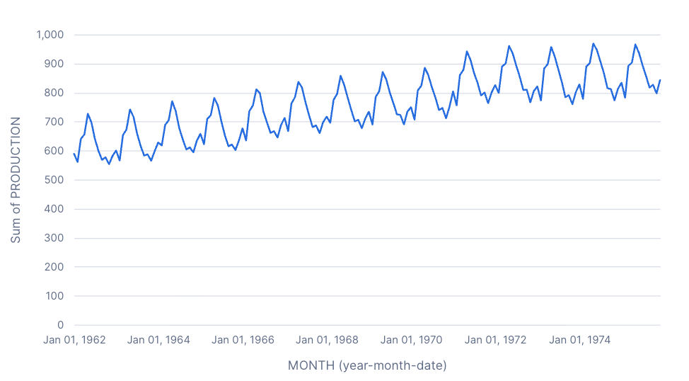

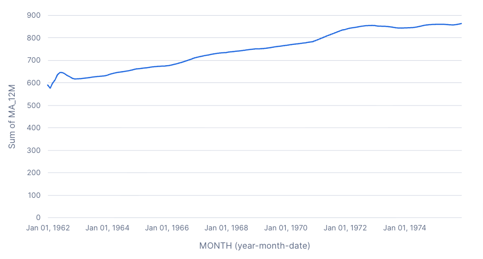

